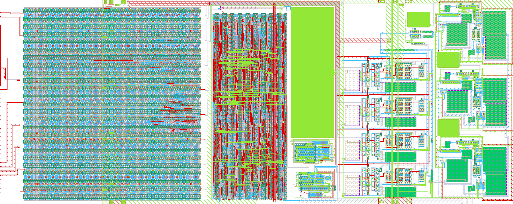
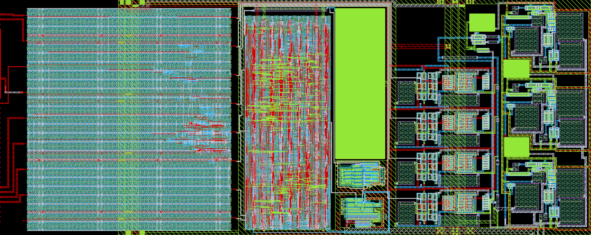
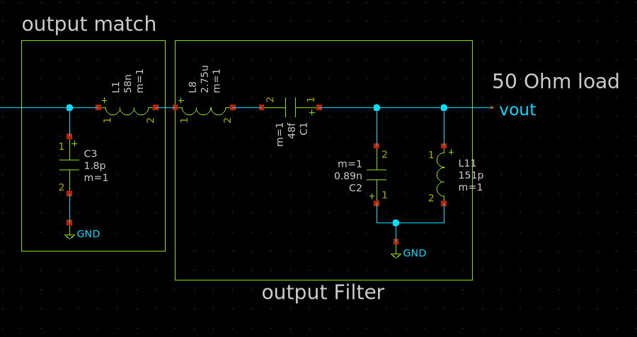
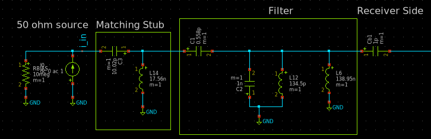
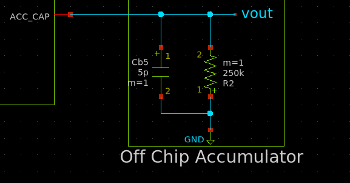
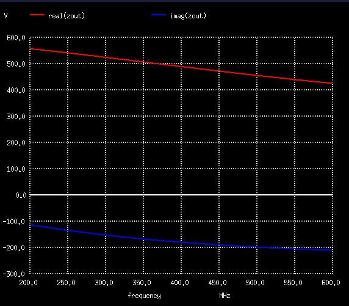
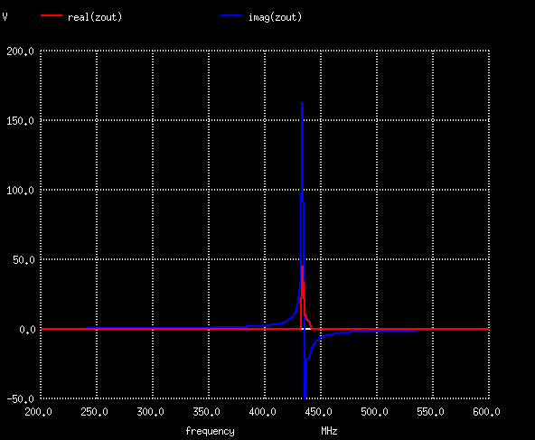
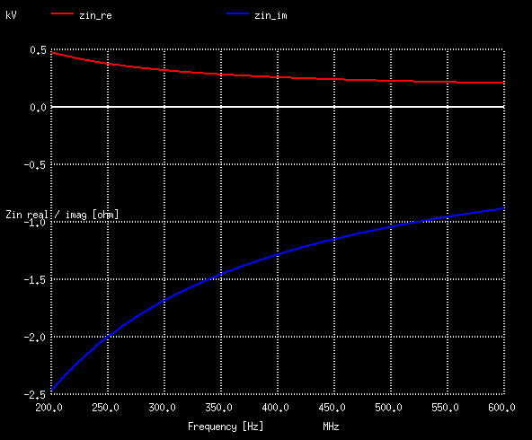
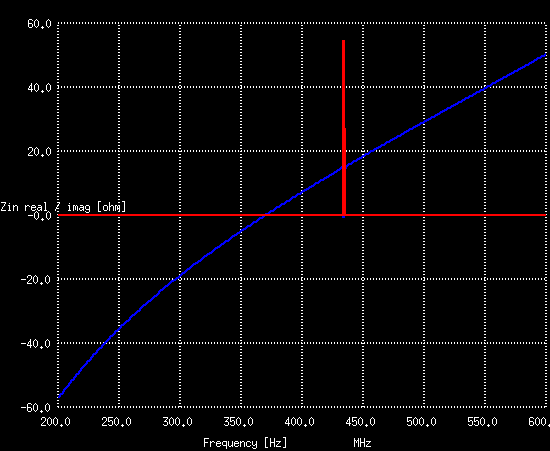

# HeiChips 2026 On-Off transmitter & receiver

An On-Off Keying (OOK) Transmitter/Receiver. It works by turning a carrier signal on and off to transmit data.

I built this because I wanted an RFIC for my first SoC design, and OOK is the simplest.

How it works (bit-bang mode): from the FPGA side, toggle the transmission pin with your favorite data encoding scheme, and hopefully you receive something on the other end. I recommend start+stop bits with Manchester encoding, and a symbol duration no shorter than 6us.

- `ui_in[0]` is connected to the transmitter's TX pin.
- `uo_out[7]` to `[4]` is connected to `q3` to `q0` of the receiver comparators.

**Receiver design**:
- A 3-stage input amplifier
- The amplifier connects to a PMOS, connected as a diode
- The diode uses an off-chip capacitor and resistor to form a peak detector
- The peak detector feeds 4 comparators, each with a threshold that ramps above 900mV based on signal strength

**Transmitter design**:
- The design uses a VCO to lock on 433.92 MHz
- The VCO feeds an output buffer, which has a transmission gate to turn the output on/off (the OOK part)
- The buffer also contains a middle tap before the transmission gate to feed the VCO output back
- The feedback clock is divided using a line of 13 flip-flops. The divided signal is fed to an FSM
- The FSM computes the frequency error and increases/decreases the duty of a DAC based on the error
- The DAC connects to a low-pass filter which feeds the VCO to set the frequency

**Digital side**:
- The digital side contains a simple 2xFF stage per comparator output to sync the comparators with the local clock domain
- The transmitter is controlled by `data_in_tx`. This signal drives the transmission gate of the output buffer with dead-time insertion

## Chip Render

| Light background | Dark background |
|---|---|
|  |  |

## PCB Matching Networks

The chip expects three off-chip analog networks:

| Sender (analog_0) | Receiver (analog_2) | Accumulator (analog_1) |
|---|---|---|
|  |  |  |

## Impedance Matching Results

Simulated input/output impedance before and after adding the matching networks above:

| | No match | With match |
|---|---|---|
| **Output (TX)** |  |  |
| **Input (RX)** |  |  |
