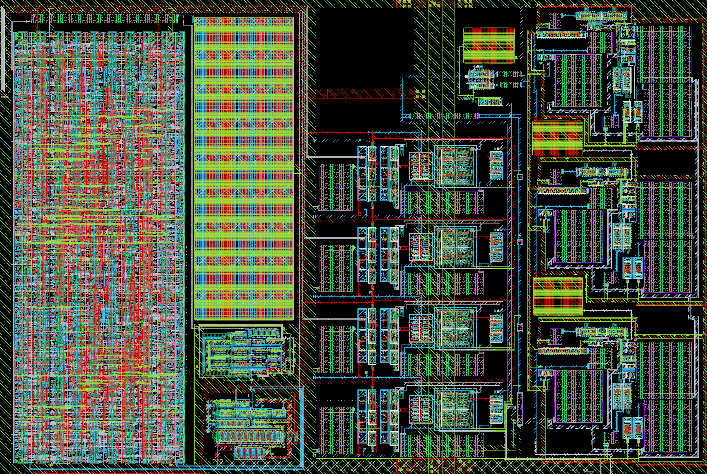

# ihp-sg13cmos5l 433.92 MHz OOK transceiver

This is the analog side of the OOK system. The receiver contains x3 amplifier stages, then a peak detector, and 4 comparator stages that output the decoded signal using 4 decoding thresholds. The transmitter contains a VCO feeding an output stage buffer. The output buffer contains a 2:1 transmission gate that can turn the output signal on/off on the digital side. The output buffer contains a tap before the transmission gate that feeds the VCO output back to a DAC for frequency locking. The DAC macro contains a frequency divider that feeds an FSM. The FSM measures the divided frequency and corrects the DAC voltage according to the error.

<p align="center">
  <a href="final/render/ook_analog_system_black.png">
    
  </a>
  <br>
  <em>Render of the layout.</em>
</p>


## Directory Structure

<details>
<summary>Show Directory Structure</summary>

```text
📁 ook_analog_system/
├─ 📁 final/
│  ├─ 📁 gds/
│  │  └─ ook_analog_system.gds
│  ├─ 📁 lef/
│  │  └─ ook_analog_system.lef
│  ├─ 📁 lib/
│  │  └─ ook_analog_system.lib
│  ├─ 📁 render/
│  │  ├─ ook_analog_system_black.png
│  │  └─ ook_analog_system_white.png
│  └─ 📁 vh/
│     └─ ook_analog_system.vh
├─ 📁 layout/
│  ├─ *.gds
│  ├─ *.klay.gds
│  └─ ook_analog_system.gds
├─ 📁 netlist/
│  ├─ 📁 layout/
│  │  ├─ *.cir
│  │  ├─ *.ext.spc
│  │  ├─ ook_analog_system_klayout.cir
│  │  └─ ook_analog_system_magic.ext.spc
│  ├─ 📁 pex/
│  │  ├─ *.spice
│  │  ├─ ook_analog_system_klayout_pex_*.spice
│  │  └─ ook_analog_system_magic_pex_*.spice
│  └─ 📁 schematic/
│     ├─ *.cdl
│     ├─ *.spice
│     ├─ ook_analog_system_klayout.cdl
│     └─ ook_analog_system_magic.spice
├─ 📁 schematic/
│  └─ 📁 xschem/
│     ├─ *.sch
│     ├─ *.sym
│     ├─ ook_analog_system.sch
│     ├─ ook_analog_system.sym
│     ├─ ook_analog_system_pex.sym
│     └─ xschemrc
├─ 📁 scripts/
│  ├─ 📁 sizing/
│  │  ├─ 📁 data/
│  │  └─ 📁 figures/
│  ├─ check_pex_ports.py
│  ├─ lay2img.py
│  ├─ sak-drc.sh
│  ├─ sak-lvs.sh
│  ├─ sak-pex.sh
│  ├─ sak-pin-reorder.py
│  └─ .sak-scripts-version
├─ 📁 testbenches/
│  └─ 📁 xschem/
│     ├─ 📁 plot_simulations/
│     │  ├─ 📁 data/
│     │  ├─ 📁 figures/
│     │  └─ ngspice2python.py
│     ├─ *_tb_*.sch
│     └─ xschemrc
├─ 📁 verification/
│  ├─ 📁 cace/
│  │  ├─ 📁 results/
│  │  ├─ 📁 scripts/
│  │  ├─ 📁 templates/
│  │  └─ ook_analog_system.yaml
│  ├─ 📁 drc/
│  │  ├─ 📁 *.klayout.drc/
│  │  ├─ 📁 *.magic.drc/
│  │  ├─ 📁 ook_analog_system.klayout.drc/
│  │  └─ 📁 ook_analog_system.magic.drc/
│  └─ 📁 lvs/
│     ├─ 📁 *.klayout.lvs/
│     ├─ 📁 *.magic.lvs/
│     ├─ 📁 ook_analog_system.klayout.lvs/
│     └─ 📁 ook_analog_system.magic.lvs/
├─ Makefile
└─ README.md
```

</details>
